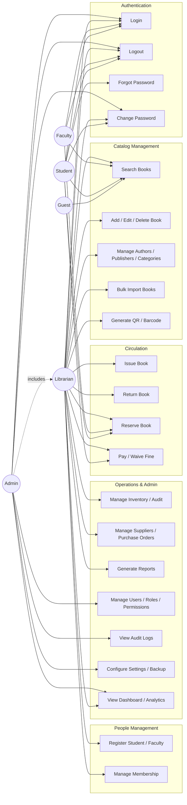

# Use Case Diagram

## Notes
- `Admin` inherits all `Librarian` use cases (generalization) plus system administration.
- `UC12 Issue Book` includes `Availability Check` and `Maximum Borrow Validation` as sub-flows.
- `UC13 Return Book` includes `Damage Check` and `Fine Calculation` as sub-flows.
- `Guest` is limited to read-only catalog search (no authentication required).
