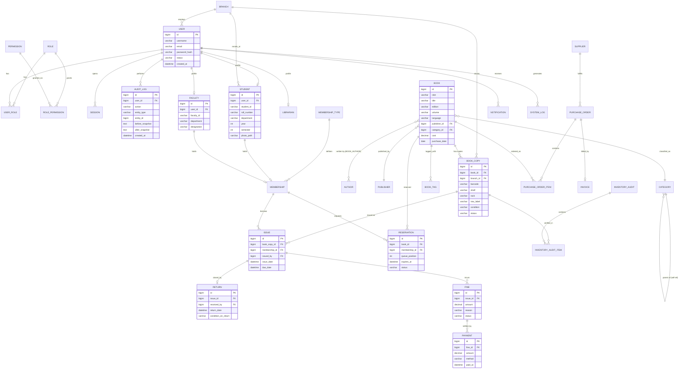

# Entity Relationship Diagram

## Cardinality Summary
- One `BOOK` → many `BOOK_COPY` (physical inventory units)
- One `BOOK_COPY` → many `ISSUE` over time, but at most one **open** issue at a time (enforced by
  business rule + partial unique index on `status = 'ISSUED'`)
- One `ISSUE` → zero-or-one `RETURN`, zero-or-many `FINE`
- One `FINE` → many `PAYMENT` (partial payments supported)
- `CATEGORY` is self-referencing to support unlimited-depth nested sub-categories
- `USER` is the security/identity root; `STUDENT`/`FACULTY`/`LIBRARIAN` are 1:1 profile extensions
