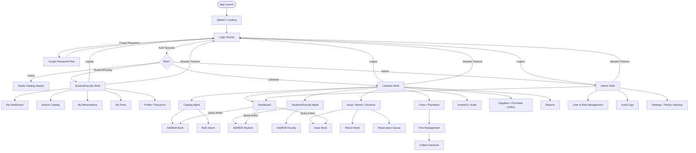

# Navigation Flow

## Notes
- The Sidebar persists across all authenticated shells; the Top Nav hosts global search,
  notifications, theme toggle, and profile menu at all times.
- Session timeout is a global interceptor: any idle session past the configured threshold routes
  back to Login regardless of current screen, after a confirmation snackbar countdown.
- Guests only ever reach the public catalog search — every other route requires authentication and
  a `RoleGuard` check at the controller level (defense in depth beyond hiding menu items).
