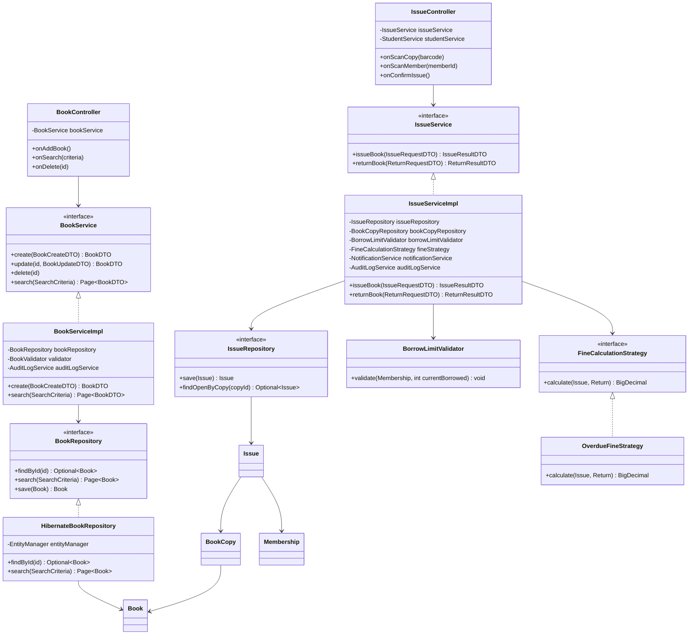

# Class Diagram (Core Circulation Slice)

Representative slice showing the pattern to be replicated across all modules (Catalog, People,
Finance, Inventory, Procurement, Reports, Admin).

## Design Notes
- Every `*Service` is an interface with exactly one primary implementation registered in
  `AppContext`; unit tests substitute mock repositories, never mock the service under test.
- `IssueServiceImpl` depends only on repository and business-layer **interfaces** — never on
  Hibernate types directly — preserving the Clean Architecture boundary.
- `DTO`s (`IssueRequestDTO`, `IssueResultDTO`, `BookDTO`) are immutable, constructed via `Builder`
  (e.g. `IssueRequestDTO.builder().memberId(..).copyBarcode(..).build()`).
- This exact controller → service(interface) → serviceImpl → repository(interface) → hibernateImpl
  shape is replicated for every one of the 30 modules listed in the SRS.
