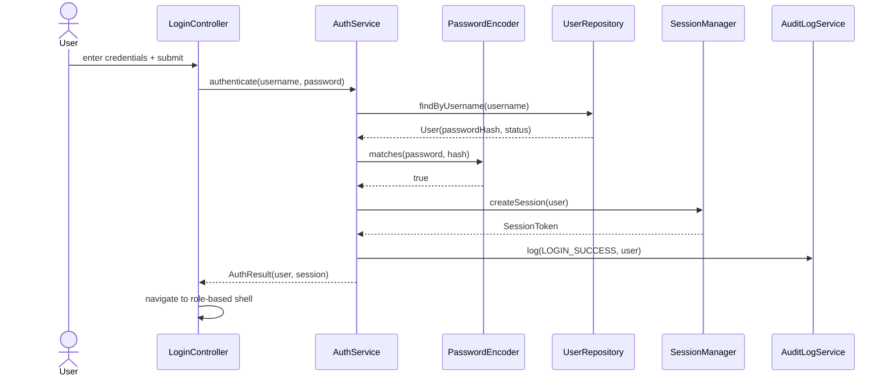
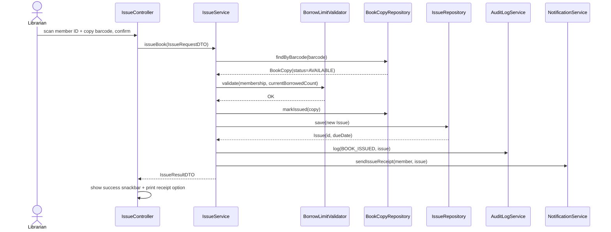
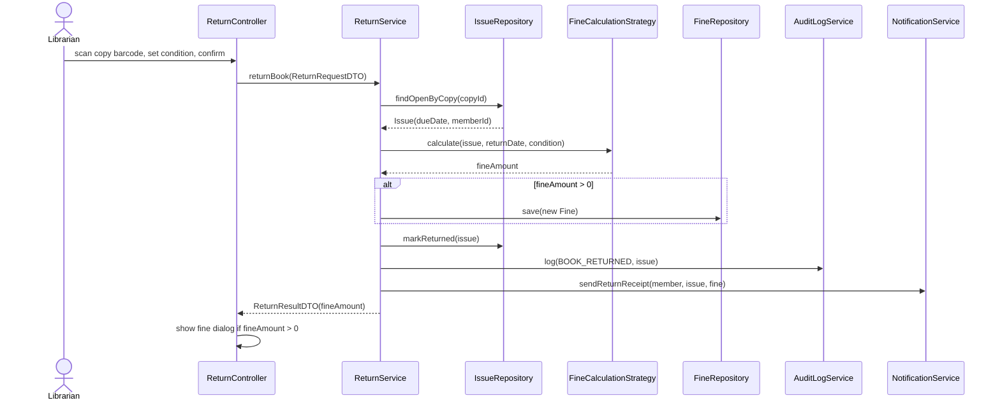
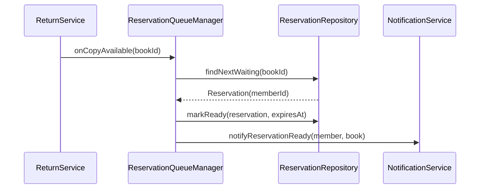
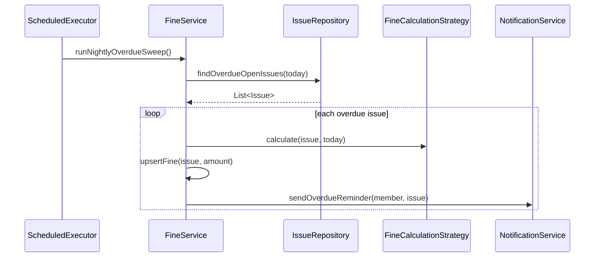
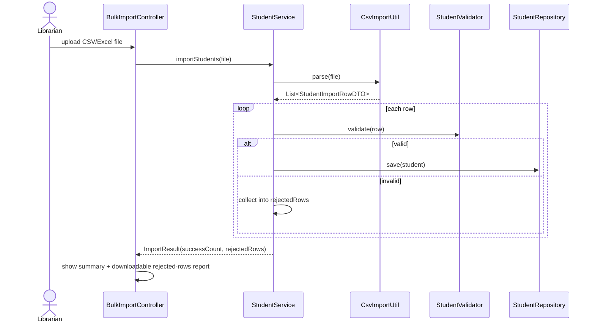

# Sequence Diagrams

## 1. Login

## 2. Issue Book

## 3. Return Book with Fine

## 4. Reservation Fulfillment (on Return)

## 5. Overdue Fine Sweep (Scheduled Job)

## 6. Bulk Student Import

